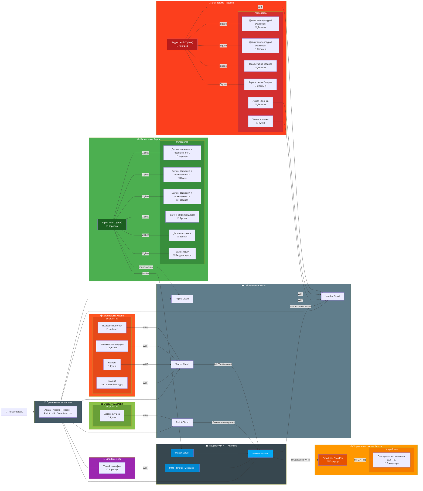

# README

This README would normally document whatever steps are necessary to get your application up and running.
NOTE: user for Raspberry = kspetrov :)

## Addons installed

* File editor - edit cfg from browser
* Samba share - edit files from explorer
* Terminal & SSH - just terminal for linux and manual installation

### Install HACS

For custom integration repos - https://hacs.xyz/docs/setup/download

After install use HA integration (add integration HACS).

* Yandex Smart Home
* Xiaomi Home
* Xiaomi Gateway 3
* PetKit
* Alarmo
* Alarmo Card

## HA integrations

* Alarmo - just testing for alarm panel (CUSTOM, not use yet)
* Broalink - for broadlink
* HACS - for custom integrations (CUSTOM)
* Matter - for other ecosystems (smart homes, ex. Aqara)
* MQTT - for domofon
* Mobile App - for phone with mobile app HA
* PetKit - for cat (CUSTOM)
* Raspberry Pi Power (Supply Checker)
* Xiaomi Home - for humidifier and vacuum cleaner (CUSTOM)
* Xiaomi Gateway 3 - for humidifier and vacuum cleaner (CUSTOM, not use yet)
* Yandex Smart Home - for integration with yandex (CUSTOM)

## Архитектура умного дома

### Общая схема

### Реализованные сценарии автоматизации

#### 1. Свет в туалете по движению ночью
- **Триггер:** движение в коридоре + освещённость ниже порога (реализовано на aqara, далее virtual switch aqara по matter уходит в HA)
- **Условие:** свет в туалете выключен
- **Действие:** включить свет в туалете

#### 2. Выключение света в туалете
- **Триггер:** движение пропало на заданное время
- **Условие:** дверь туалета открыта определенное время
- **Действие:** выключить свет в туалете

#### 3. Away Mode (режим «ухожу из дома»)
- **Триггер:** включение `door_lock_away_mode` на замке N100
- **Действие:** выключить свет во всех комнатах

#### 4. Открытие замка снаружи
- **Триггер:** выключение `door_lock_away_mode` на замке N100
- **Действие:** включить свет в туалете и ванной

### Идеи для развития

#### Климат-контроль

| Сценарий | Триггер | Действие |
|----------|---------|----------|
| Поддержание температуры в детской | Датчик Яндекса < 21°C | Открыть термостат |
| Ночное понижение температуры | 23:00 – 07:00 | Установить 18°C на оба термостата |
| Увлажнение по расписанию | Каждые 2 часа днём | Включить увлажнитель на 15 минут |
| Слишком сухо | Влажность < 40% | Голосовое уведомление на колонку |

#### Безопасность

| Сценарий | Триггер | Действие |
|----------|---------|----------|
| Протечка в ванной | Датчик протечки → wet | Уведомление в HA + голос на колонку |
| Входная дверь открыта ночью | Замок открыт с 00:00 до 06:00 | Включить свет в коридоре + уведомление |
| Дверь долго открыта | Открыта > 2 минут | Уведомление на колонку |
| Движение ночью на камере | Камера в коридоре обнаружила движение | Отправить снимок в Telegram |

#### Уборка и рутина

| Сценарий | Триггер | Действие |
|----------|---------|----------|
| Уборка при уходе | Активация Away Mode | Roborock → уборка всей квартиры |
| Вернулся — пылесос на базу | Замок открыт снаружи | Roborock → dock |
| Кормление кошки | 09:00 и 21:00 | Petkit → выдать порцию |
| Низкий уровень корма | Уведомление от Petkit | Уведомление в HA + голос на колонку |

### Список устройств

#### Aqara (Zigbee → Aqara Hub → Matter → HA)

| Устройство | Расположение |
|------------|--------------|
| Aqara Hub | Коридор |
| Датчик движения + освещённость | Коридор |
| Датчик движения + освещённость | Кухня |
| Датчик движения + освещённость | Гостиная |
| Датчик открытия двери | Туалет |
| Датчик протечки | Ванная |
| Замок N100 | Входная дверь |

#### Lovolo + BroadLink

| Устройство | Расположение |
|------------|--------------|
| BroadLink RM4 Pro | Коридор |
| Сенсорные выключатели 2.4 ГГц | во всей квартире |

#### Xiaomi (облачная интеграция)

| Устройство | Расположение |
|------------|--------------|
| Roborock пылесос | Кабинет |
| Увлажнитель воздуха | Детская |
| Камера | Кухня |
| Камера | Спальня / коридор |

#### Яндекс (Zigbee → Яндекс Хаб + облако)

| Устройство | Расположение |
|------------|--------------|
| Яндекс Хаб | Коридор |
| Датчик температуры/влажности | Детская |
| Датчик температуры/влажности | Спальня |
| Термостат на батарее | Детская |
| Термостат на батарее | Спальня |
| Умная колонка | Детская |
| Умная колонка | Кухня |

#### Прочие устройства

| Устройство | Расположение | Интеграция |
|------------|--------------|-------------|
| Raspberry Pi 4 (8GB) | Коридор | Home Assistant OS |
| Smartintercom | Коридор | MQTT |
| Petkit автокормушка | Кухня | Облачная интеграция |

### Типы интеграций

| Связь | Тип | Направление |
|-------|-----|-------------|
| Aqara Hub → HA | Matter (локально) | Данные от датчиков |
| HA → Яндекс | Yandex Smart Home (облако) | Управление голосом |
| BroadLink → HA | Локальная интеграция | Управление светом |
| HA → BroadLink | Wi-Fi → RF 2.4 ГГц | Команды на выключатели |
| Xiaomi → HA | MIoT (облако) | Данные и управление |
| Petkit → HA | Облачная интеграция | Данные и управление |
| Smartintercom → HA | Wi-Fi → MQTT | Данные и управление |
| Яндекс Хаб → Яндекс Облако | Wi-Fi | Данные датчиков |

### Заметки

- Все датчики Aqara работают через Matter стабильно
- Устройства Яндекса не проброшены в HA (только HA → Яндекс)
- MQTT брокер (Mosquitto) работает на том же RPi4
- Для отладки MQTT: `mosquitto_sub -t "#" -v`

### HA tricks
* sometimes, may be after update core or OS DNS need to be restarted for access homeassistant.local:8123. Use command ha dns restart
* mobile app integration after del you need logout from mapp, restart HA and login to mapp
* Aqara Bridge - в основном для управления (Aqara Bridge решает другие задачи, а не задачу "получить статус датчика в реальном времени".). Не подходит
* Aqara Gateway - не подходит для моей модели хаба, только перепайка поможет
* Поэтому Aqara через matter. Локально зато, а не облако. Но есть проблемы
  * Не все датчики по matter дают состояние свое постоянно. Часто это импульс (вкл и сразу выкл). Причем в HA это прилетает только первый раз, а потом нужно длительное время чтобы опять эта штука отбросилась в HA
  * Поэтому пришлось на Aqara городить виртуальный выключатель (просто автоматизация левая), но зато можно отлавливат ее состояние вкл и выкл

---

*Актуально на 29.05.2026*
